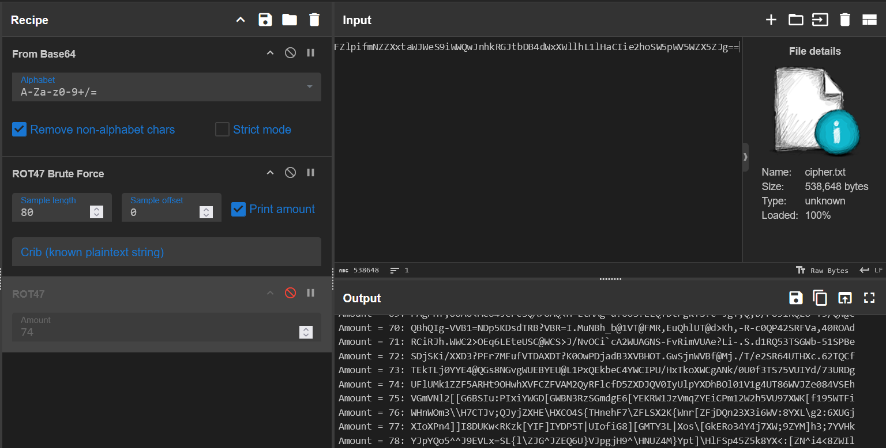

# Post Quantum Resistant Crypto for Enterprises
Solved by fjellape

### Description
Author: zledge
>Enterprises are worried about the advent of quantum computers breaking their cryptographic systems. As a result, they are exploring post-quantum cryptographic algorithms to secure their data against harvest-now-decrypt-later threats. You are hired as a cryptography consultant to verify the strength of the current implementation of the post-quantum crypto that they have rolled in fare for losing data to quatum crooks. The crypto is so strong that is should be resistant to any crypto analysis even when the full encryption code is known. As a reward, a flag has been encrypted.
Using a quantum computer with sufficient qubits is not regarding a cheating in this challenge, but it should not give you any advantage either since the crypto is post-quantum safe.

### Writeup
The challenge provides `encryptor.py` and `cipher.txt`. From the `encrypt` function in `encryptor.py` we get a pretty clear picture of how this super strong crypto works:
```py
def encrypt(plaintext, key):
    """
    Encrypt plaintext using the key with ROT47 and base64 encoding.
    For each character in the key, apply ROT47 to the entire text, then base64 encode.
    """
    if not key:
        raise ValueError("Key cannot be empty")
    
    # Start with the plaintext
    ciphertext = plaintext
    
    # For each character in the key
    for key_char in key:
        # Apply ROT to the entire current ciphertext
        ciphertext = rot_string(ciphertext, shift=int(ord(key_char)))
        
        # Base64 encode the result
        encoded_bytes = base64.b64encode(ciphertext.encode('ascii'))
        ciphertext = encoded_bytes.decode('ascii')
    
    return ciphertext
```

Treating this caliber of post quantum resistant crypto with the respect it deserves, the only real choice is solving it manually in CyberChef.
I use the "ROT47 Brute Force" operation to find the ROT47 shift amount that most resembles a base64 string, then replace the "ROT47 Brute Force" with a regular "ROT47" operation with that amount of shifts. Just repeat this until the flag appears.



<details>
<summary>Click to show final CyberChef recipe</summary>

```
From_Base64('A-Za-z0-9+/=',true,false)
ROT47(74)
From_Base64('A-Za-z0-9+/=',true,false)
ROT47(20)
From_Base64('A-Za-z0-9+/=',true,false)
ROT47(74)
From_Base64('A-Za-z0-9+/=',true,false)
ROT47(83)
From_Base64('A-Za-z0-9+/=',true,false)
ROT47(66)
From_Base64('A-Za-z0-9+/=',true,false)
ROT47(11)
From_Base64('A-Za-z0-9+/=',true,false)
ROT47(9)
From_Base64('A-Za-z0-9+/=',true,false)
ROT47(22)
From_Base64('A-Za-z0-9+/=',true,false)
ROT47(67)
From_Base64('A-Za-z0-9+/=',true,false)
ROT47(37)
From_Base64('A-Za-z0-9+/=',true,false)
ROT47(78)
From_Base64('A-Za-z0-9+/=',true,false)
ROT47(29)
From_Base64('A-Za-z0-9+/=',true,false)
ROT47(46)
From_Base64('A-Za-z0-9+/=',true,false)
ROT47(20)
From_Base64('A-Za-z0-9+/=',true,false)
ROT47(46)
From_Base64('A-Za-z0-9+/=',true,false)
ROT47(8)
From_Base64('A-Za-z0-9+/=',true,false)
ROT47(68)
From_Base64('A-Za-z0-9+/=',true,false)
ROT47(6)
From_Base64('A-Za-z0-9+/=',true,false)
ROT47(76)
From_Base64('A-Za-z0-9+/=',true,false)
ROT47(37)
From_Base64('A-Za-z0-9+/=',true,false)
ROT47(80)
From_Base64('A-Za-z0-9+/=',true,false)
ROT47(8)
From_Base64('A-Za-z0-9+/=',true,false)
ROT47(73)
From_Base64('A-Za-z0-9+/=',true,false)
ROT47(75)
From_Base64('A-Za-z0-9+/=',true,false)
ROT47(91)
From_Base64('A-Za-z0-9+/=',true,false)
ROT47(68)
From_Base64('A-Za-z0-9+/=',true,false)
ROT47(16)
From_Base64('A-Za-z0-9+/=',true,false)
ROT47(90)
From_Base64('A-Za-z0-9+/=',true,false)
ROT47(13)
From_Base64('A-Za-z0-9+/=',true,false)
ROT47(69)
From_Base64('A-Za-z0-9+/=',true,false)
ROT47(75)
From_Base64('A-Za-z0-9+/=',true,false)
ROT47(14)
```
</details>
<br>

Here is the recovered plaintext:
`TheFlagIs:EPT{a42d061e-5798-459e-a1a7-9d04ee236dab}`