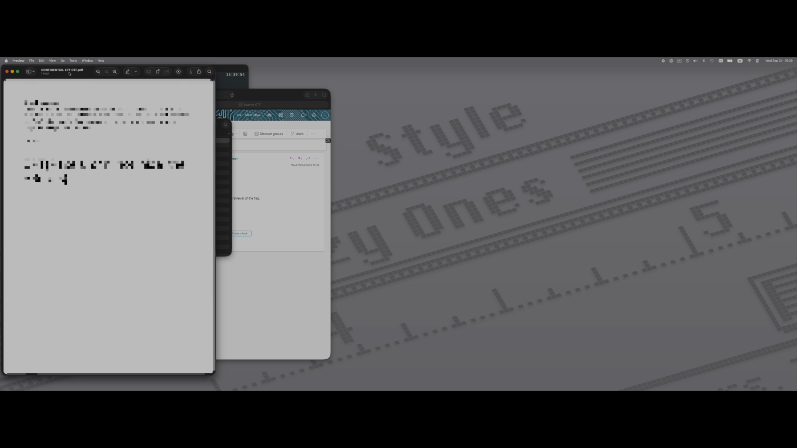
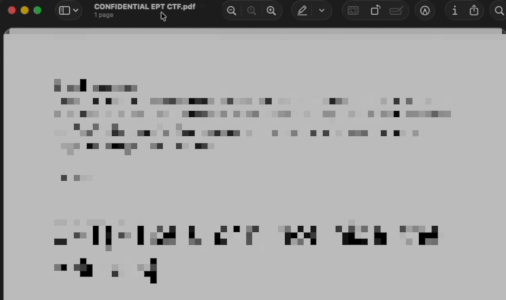
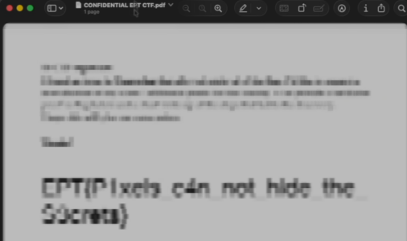

# censored

**Writeup and solve by:** bop.exe

This challenged involved a 18 second video with a .pdf with pixelated text being dragged across the screen. The goal was to recover the pixelated text.
My solution was to track and crop the PDF window across multiple frames, then *average* the aligned crops to reveal the original text.

---

## Input Frames

Below is an example of one of the raw frames with the pdf visible:



We also use a small reference image to detect and align the PDF window inside each frame:


---

## Approach

The recovery happens in three steps:

### 1. Extract all frames where the PDF window is visible
I extracted the relevant frames from the video with `ffmpeg` and saved them into `frames/`.
The pdf started moving around frame ~760-790, so I just saved from frame 760.

```powershell
"ffmpeg.exe" -i "CONFIDENTIAL EPT CTF.mov" -vf "select='gte(n,760)'" -vsync vfr frames/%06d.png
```

### 2. Track and Crop the PDF Window (`track.py`)
This script takes:
- The template (`template.png`)
- Each raw screenshot (`frames/*.png`)

It uses template matching to find the top-left of the PDF window and crops a fixed rectangle containing the document content.

Resulting aligned crops are saved to `tracked/`.

Example of a cropped output:



### 3. Average the Cropped Images (`average.py`)
Once all frames are aligned, we stack them and compute the mean pixel value across all frames.  
This reconstructs a somewhat readable version of the pdf.

Averaged output:



Clearly says EPT{Pixels can not hide the secrets} with some l33tspeak in there.

## Flag
From here it just took some guessing to find the final flag
`EPT{P1xels_c4n_not_hide_the_S3crets}`