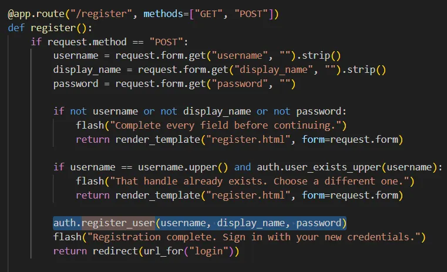
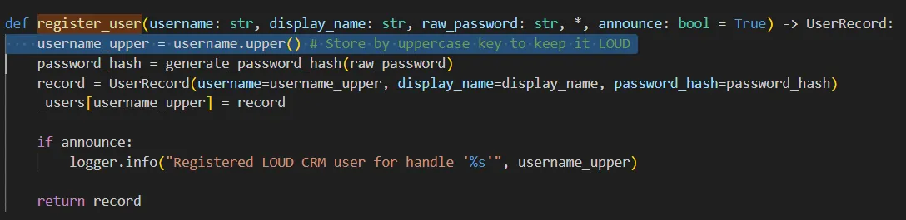
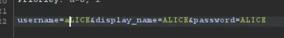

# Writeup: Loud CRM
## Team: big🔥
**Author:** SpaceyLad (Stian Kvålshagen)

Go into the platform with Burp.. As usual with these web tasks

The task hints on everything being in capital letters.. Which immediately gives me a feeling that some characters might be changed from non capital letters to capital letters.. Especially since we have to get access to an already existing user. 

When reading through the code, I see that the username check is done before it converts lower case to capital letters.

This means that if we make a user called “aLICE”, it will be checked against “ALICE”, which will be false. Then it will be put into the system and be converted to capital letters. In this case “ALICE”. 

I capture the register payload with Burp suite and change the first letter in “ALICE” to “aLICE”. This is successful as expected and we have created a user.

Then I simply log in with aLICE:ALICE and become ALICE!

